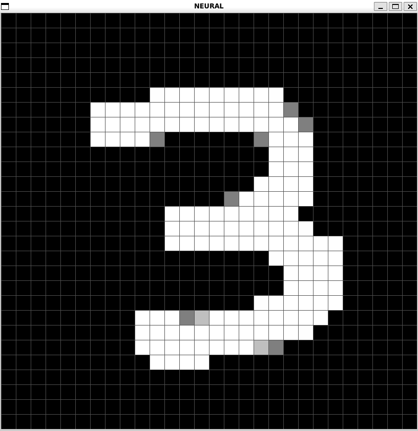

# Neural

Fully connected feedforward neural network trained with stochastic gradient descent on the MNIST database.

* `Q` to guess the digit,
* `C` to clear the screen.
* `G` to toggle the grid.
* Left click to draw.
* right click to erase.

```bash
g++ main.cpp network.cpp train.cpp -o main `sdl2-config --cflags --libs` -lm
```

